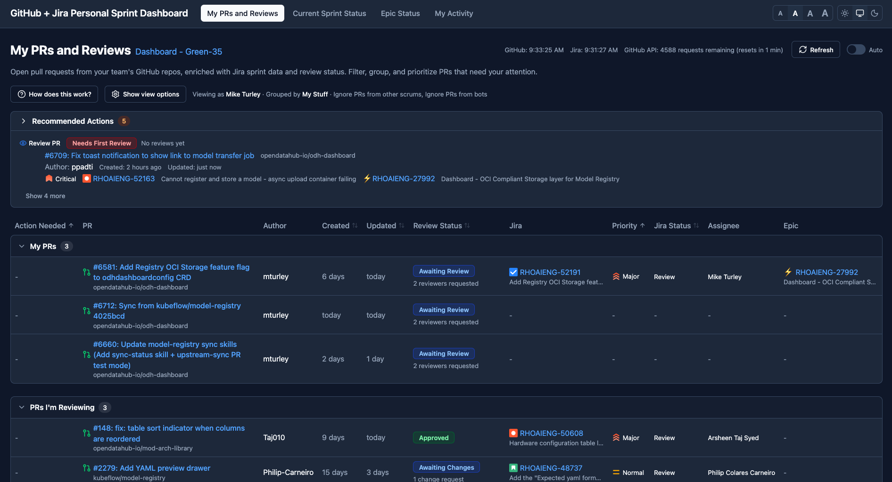
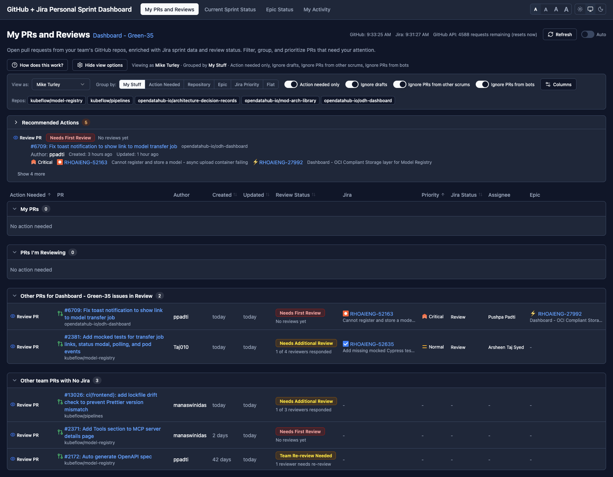
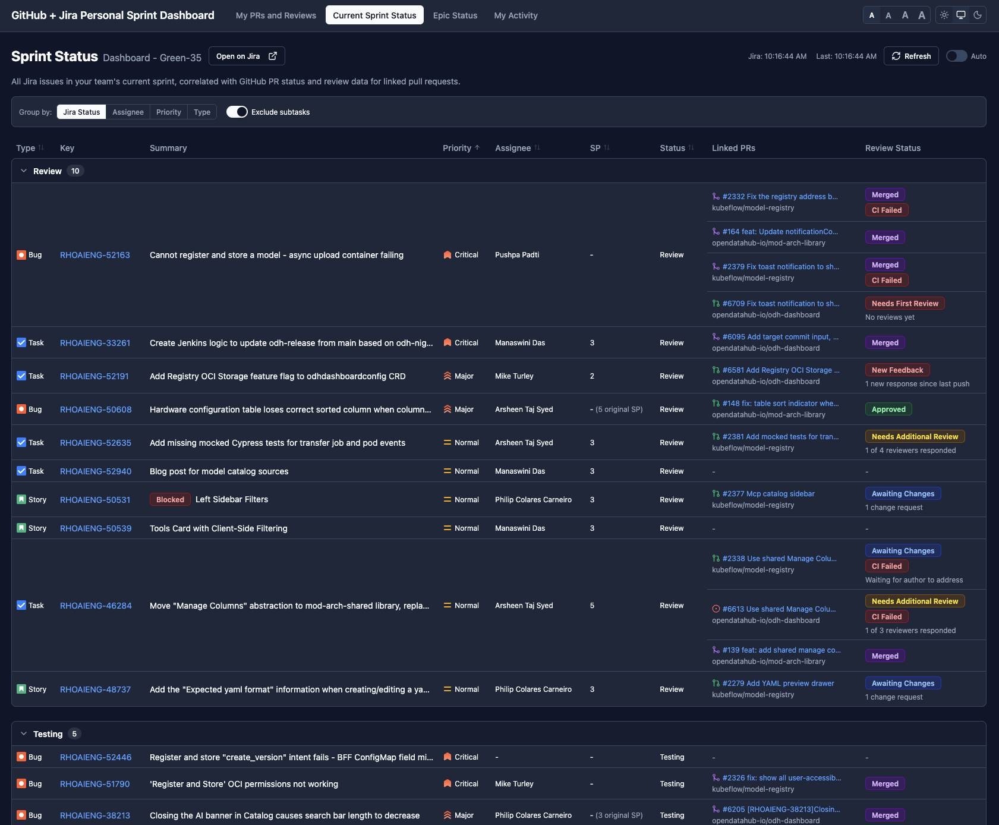
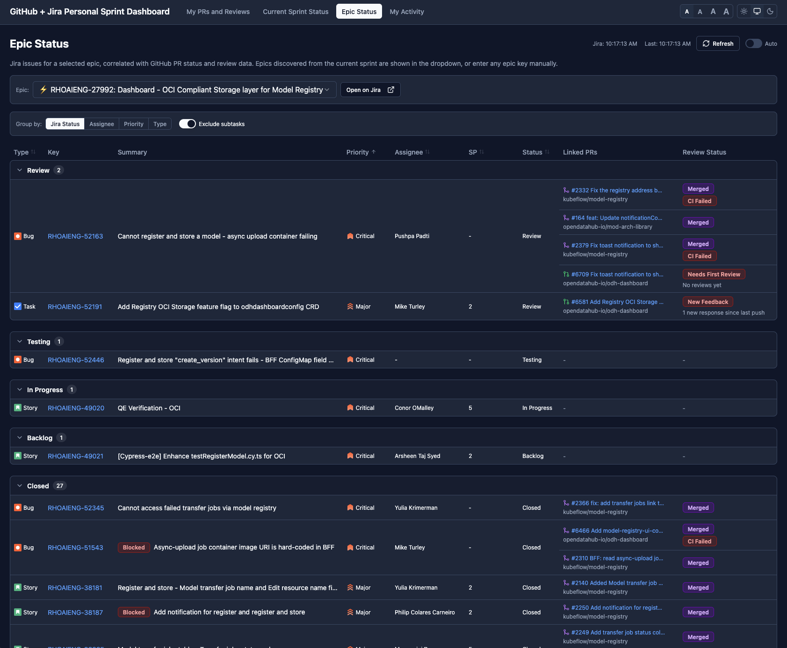
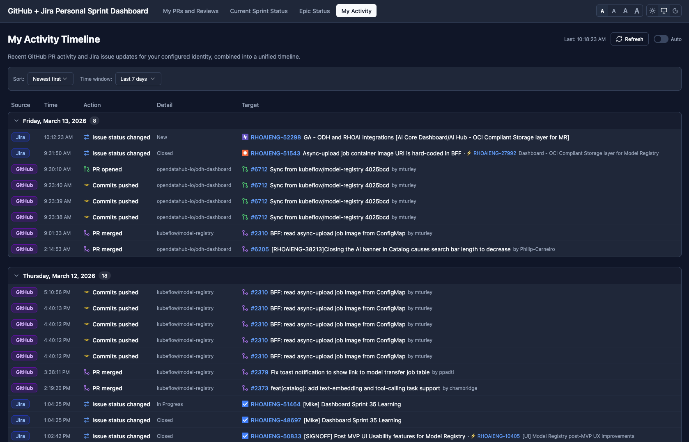
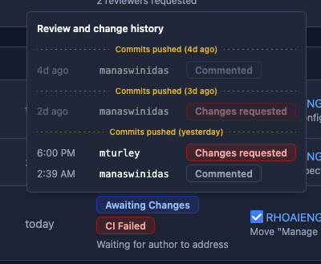
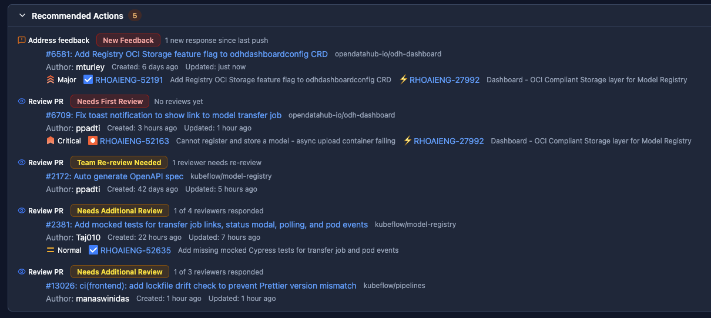
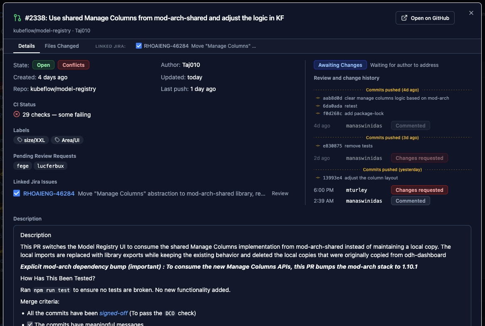
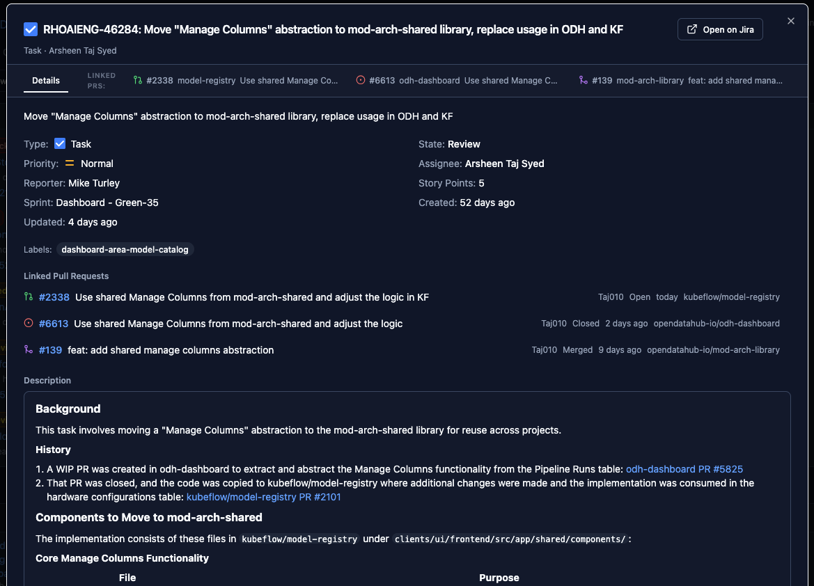
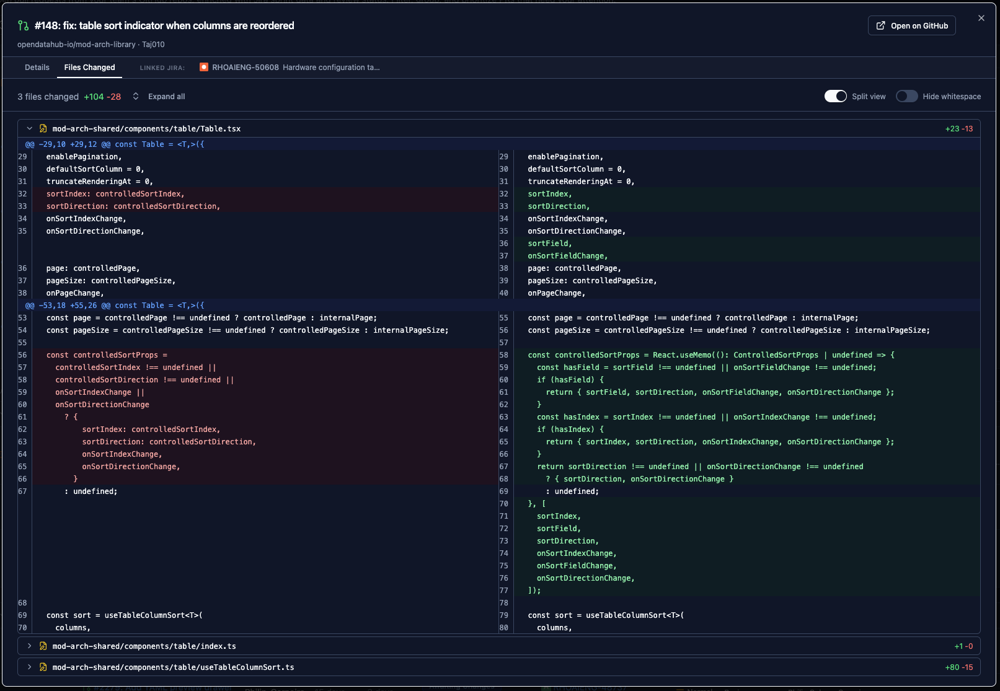

# PR Reviews Dashboard

A local-only web dashboard that combines GitHub PR data with Jira issue metadata to give you a unified view of your team's code review workload. All data stays local -- nothing is stored on external servers.



## Features at a Glance

- **Four integrated views** -- PR Reviews, Sprint Status, Epic Status, and Activity Timeline
- **Smart review status** -- automatically computes what action you need to take on each PR, from both author and reviewer perspectives
- **Priority-sorted recommended actions** -- always know what to work on next
- **Inline detail modal** -- view PR diffs, review history, and Jira issue details without leaving the dashboard
- **Progressive data loading** -- fetches GitHub data first, then Jira, then discovers additional PRs linked from Jira issues
- **GitHub + Jira correlation** -- bidirectional linking between PRs and Jira issues with sprint and epic context
- **Dark mode and light mode** -- full theme support with system preference detection
- **PWA installable** -- add to your dock for an app-like experience
- **Configurable auto-refresh** -- intervals from 1 minute to 1 hour
- **Bot-aware** -- filters bot reviews from status computation while keeping them visible in timelines

## Quick Start

```bash
pnpm install
cp .env.example .env
# Edit .env with your GitHub and Jira tokens
pnpm dev
# Open http://localhost:5173
```

On first run, the server creates a `config.local.json` where you configure your team members, GitHub orgs, and Jira project. See [SETUP.md](SETUP.md) for detailed configuration, development commands, and troubleshooting. For a deep dive into the codebase structure, data flow, and design decisions, see [ARCHITECTURE.md](ARCHITECTURE.md).

## Views

### My PRs and Reviews

The main dashboard showing all open PRs relevant to you and your team. PRs are automatically grouped into priority buckets:

- **My PRs** -- pull requests you authored
- **PRs I'm Reviewing** -- PRs where you've submitted a review or are @-mentioned
- **Sprint Review PRs** -- PRs linked to Jira issues currently in Review status
- **Team PRs with No Jira** -- team member PRs without linked Jira issues (including dependabot)

Each PR shows its computed review status, CI state, linked Jira issue with priority, epic, assignee, and a recommended action. You can regroup by action needed, repository, epic, Jira priority, or view flat. A perspective selector lets you view the dashboard as any team member or the whole team.



### Current Sprint Status

A Jira-primary view of all issues in your team's active sprint, correlated with linked GitHub PR data. Issues are groupable by status, assignee, priority, or type, and show story points, PR state, and review status. The sprint name links to the internal sprint view, with an "Open on Jira" button for the external board.



### Epic Status

Browse all issues in a selected epic with linked PR metadata. Choose from epics discovered in the current sprint, or enter any epic key manually. Includes merged PRs with full review history.



### My Activity Timeline

A unified chronological feed merging GitHub PR events (opened, merged, closed, reviewed, commented, pushed) with Jira issue updates (status changes, field updates, creation). Events are grouped by day with collapsible sections, per-action-type icons, and configurable time windows (today through last 30 days).



## Smart Review Status

The dashboard computes a context-aware review status for every PR based on your relationship to it. Statuses are perspective-dependent -- you see different information as a PR author vs. a reviewer.

**As a PR author**, you'll see:
- **New Feedback** -- reviewers have commented or reviewed since your last push
- **Approved / Ready to Merge** -- all approvals in, CI passing
- **Awaiting Review** -- waiting for reviewers with a count of pending requests
- **CI Failing** -- checks are failing on your approved PR
- **WIP** -- draft PR or work-in-progress label detected

**As a reviewer**, you'll see:
- **My Re-review Needed** -- the author pushed new commits since your last review
- **Needs First Review** -- no human reviews yet (prioritized highest)
- **I'm Mentioned** -- you're @-mentioned in comments
- **Team Re-review Needed** -- other team members need to re-review
- **Awaiting Changes** -- you requested changes and the author hasn't pushed yet

Hovering over any status badge reveals a **reviewer breakdown tooltip** -- a chronological timeline of all reviews and comments with "Commits pushed" dividers between review rounds. Stale reviews (before the latest push) are visually dimmed.



## Recommended Actions

An always-visible panel showing your highest-priority action items, sorted by:

1. **Action urgency** -- address feedback > fix CI > review PR > complete work > merge
2. **Status sub-priority** -- "Needs First Review" ranks above "Team Re-review Needed"
3. **Jira priority** -- Blocker > Critical > Major > Normal > Minor
4. **PR age** -- oldest PRs surface first

Each action item shows the action type with an icon, the PR link, author, timestamps, and linked Jira issue with priority.



## Detail Modal

Click any PR or Jira issue link to open an inline detail modal without leaving the dashboard. PR modals include tabs for linked Jira issues, and Jira issue modals include tabs for linked PRs -- so you can navigate the full context of any work item without leaving the page.

**PR details** include:
- Description and metadata
- Full review and change history timeline
- Review status badge
- Pending review requests
- Tabs for each linked Jira issue



**Jira issue details** include:
- Summary, description (rendered from Jira wiki markup), and comments
- Status, priority, assignee, story points
- Blocked flag with reason
- Tabs for each linked PR with state icons



**Diff viewer** for PR file changes:
- Unified or side-by-side split view
- Hide whitespace toggle
- Line numbers
- Expand/collapse all files
- Sticky toolbar



Missing data for linked items is lazy-loaded on demand.

## UI Features

- **Dark / Light / System theme** -- three-way toggle in the navbar with full color palette for each mode
- **Font size control** -- four sizes (extra small, small, medium, large) for information density
- **Progressive loading stepper** -- visual progress indicator showing Configuration, GitHub PRs, Jira Sprint, and Linked PRs loading phases
- **Auto-refresh** -- shared across all views with configurable intervals (1m, 2m, 5m, 10m, 30m, 1h)
- **GitHub rate limit display** -- real-time remaining requests and countdown to reset
- **Error boundaries** -- route-level error catching with "Try again" recovery
- **URL state persistence** -- filters, grouping, and perspective selections are preserved in the URL
- **PWA manifest** -- installable as a standalone app with custom icon
- **Collapsible view options** -- filter bar, column customizer, and actions panel collapse to save space
- **Server-side caching** -- 60-second TTL cache on GitHub and Jira API responses to reduce rate limit consumption

## Tech Stack

TypeScript, React 19, Vite 6, tRPC 11, TanStack Query + Table, Express 5, Tailwind CSS 4, shadcn/ui, React Router 7
